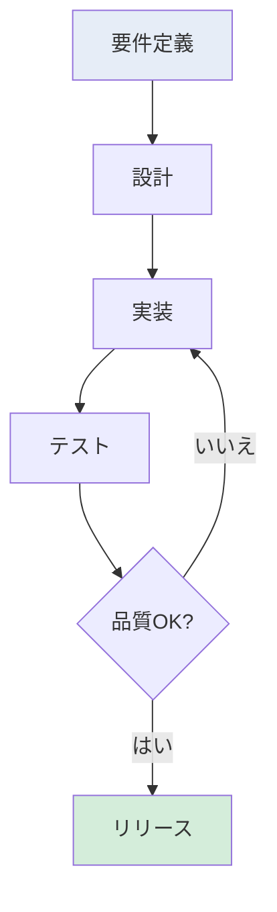

<!-- 
このMARPテンプレートには以下の特徴があります：
1. 標準よりも大きいフォントサイズ（基本1.15em）
2. 見出しのスタイリング（H1には下線、H2はブルー色）
3. 表や箇条書きの最適化
4. 要素間の適切な余白設定
5. 視認性の高いカラースキーム

以下のスライドでは様々なデザインパターンが利用可能です：
- カード型レイアウト
- グリッドレイアウト
- 強調表示付きリスト
- スタイリングされた表
- SVG画像の埋め込み
- Mermaid図（フローチャート、シーケンス図など）
- Chart.jsグラフ（棒グラフ、円グラフなど）
-->

<!-- _class: title -->

# プレゼンテーションタイトル

発表者名  
所属・肩書き

---

<!-- 
パターン1: シンプルなグリッドレイアウト
複数の項目を視覚的に分離する場合に使用
-->

# セクションタイトル1

## サブタイトル

### 項目1：
- **重要なポイント1**
- **重要なポイント2**
- **重要なポイント3**

### 項目2：
- **重要なポイント1**
- **重要なポイント2**

---

<!-- 
パターン2: カード型リスト
各項目を個別のカードとして表示する場合に使用
-->

# セクションタイトル2

## サブタイトル

1. 項目タイトル

項目の詳細説明。簡潔かつ分かりやすい表現で記述します。

2. 項目タイトル

項目の詳細説明。簡潔かつ分かりやすい表現で記述します。

3. 項目タイトル

項目の詳細説明。簡潔かつ分かりやすい表現で記述します。

---

<!-- 
パターン3: アイコン型リスト
視覚的なブロックとして項目を表示する場合に使用
-->

# セクションタイトル3

## サブタイトル

小見出し1

ここに詳細テキストを記述します。箇条書きや短い文章で説明します。

小見出し2

ここに詳細テキストを記述します。 
改行を使用して読みやすくすることも可能です。

小見出し3

ここに詳細テキストを記述します。表やリストの埋め込みも可能です。

---

<!-- 
パターン4: 表組み
データを整理して表示する場合に使用
-->

# セクションタイトル4

## サブタイトル

| 項目1 | 項目2 | 項目3 | 項目4 |
| ----- | ----- | ----- | ----- |
| データ1 | データ2 | 強調データ | データ4 |
| データ5 | データ6 | 強調データ | データ8 |
| データ9 | データ10 | データ11 | データ12 |

---

<!-- 
パターン5: 画像挿入
SVGやPNG画像を中央に表示する場合に使用
-->

# セクションタイトル5

## サブタイトル

<!-- ここにSVGまたは画像ファイルを挿入 -->
<!--  -->
<svg width="100%" height="300" viewBox="0 0 600 300" xmlns="http://www.w3.org/2000/svg" preserveAspectRatio="xMidYMid meet">
  <!-- サンプルグラフ -->
  <rect x="50" y="50" width="80" height="200" fill="#4472C4" />
  <rect x="180" y="100" width="80" height="150" fill="#ED7D31" />
  <rect x="310" y="80" width="80" height="170" fill="#A5A5A5" />
  <rect x="440" y="120" width="80" height="130" fill="#FFC000" />
  
  <!-- 軸 -->
  <line x1="50" y1="250" x2="520" y2="250" stroke="black" stroke-width="2"/>
  <line x1="50" y1="50" x2="50" y2="250" stroke="black" stroke-width="2"/>
  
  <!-- ラベル -->
  <text x="90" y="270" text-anchor="middle" font-size="14">項目1</text>
  <text x="220" y="270" text-anchor="middle" font-size="14">項目2</text>
  <text x="350" y="270" text-anchor="middle" font-size="14">項目3</text>
  <text x="480" y="270" text-anchor="middle" font-size="14">項目4</text>
</svg>

図1: SVGで作成したサンプルグラフ

---

<!-- 
パターン6: 問題と解決策
対比して表示したい場合に使用
-->

# セクションタイトル6

## サブタイトル

問題点1
→
解決策または対応方法の説明

問題点2
→
解決策または対応方法の説明

問題点3
→
解決策または対応方法の説明

---

<!-- 
パターン7: 予算表
数値データに強調を入れる場合に使用
-->

# セクションタイトル7

## サブタイトル

予算表

| 項目 | 金額 | 詳細 |
| ----- | ----- | ----- |
| 項目1 | xxx円 | 項目の詳細説明 |
| 項目2 | xxx円 | 項目の詳細説明 |
| 項目3 | xxx円 | 項目の詳細説明 |

---

<!-- 
パターン8: 箇条書きリスト
重要な項目を強調表示する場合に使用
-->

# セクションタイトル8

## サブタイトル

大見出し1

リスト項目1

リスト項目2

リスト項目3

大見出し2

リスト項目1

リスト項目2

---

<!-- 
パターン9: 2列グリッド
情報を横に2列で表示する場合に使用
-->

# セクションタイトル9

項目1の説明文。簡潔かつ分かりやすい表現で記述します。

項目2の説明文。簡潔かつ分かりやすい表現で記述します。

項目3の説明文。簡潔かつ分かりやすい表現で記述します。

項目4の説明文。簡潔かつ分かりやすい表現で記述します。

---

<!-- 
パターン10: SVGフローチャート
プロセスフローをSVGで表示
重要: viewBoxの高さはすべての要素が収まるように設定すること
-->

# SVGフローチャートの例

## プロセスフローの可視化

<svg width="100%" height="350" viewBox="0 0 600 450" xmlns="http://www.w3.org/2000/svg" preserveAspectRatio="xMidYMid meet">
  <!-- 開始 -->
  <rect x="250" y="20" width="100" height="40" rx="20" fill="#f9f" stroke="#333" stroke-width="2"/>
  <text x="300" y="45" text-anchor="middle" font-size="14">開始</text>
  
  <!-- 条件判定 -->
  <polygon points="300,90 350,125 300,160 250,125" fill="#bbf" stroke="#333" stroke-width="2"/>
  <text x="300" y="130" text-anchor="middle" font-size="13">条件判定</text>
  
  <!-- 処理1 -->
  <rect x="100" y="190" width="100" height="40" fill="#e6edf7" stroke="#333" stroke-width="2"/>
  <text x="150" y="215" text-anchor="middle" font-size="13">処理1</text>
  
  <!-- 処理2 -->
  <rect x="400" y="190" width="100" height="40" fill="#e6edf7" stroke="#333" stroke-width="2"/>
  <text x="450" y="215" text-anchor="middle" font-size="13">処理2</text>
  
  <!-- 結果出力 -->
  <rect x="250" y="260" width="100" height="40" fill="#e6edf7" stroke="#333" stroke-width="2"/>
  <text x="300" y="285" text-anchor="middle" font-size="13">結果出力</text>
  
  <!-- 終了 -->
  <rect x="250" y="330" width="100" height="40" rx="20" fill="#f9f" stroke="#333" stroke-width="2"/>
  <text x="300" y="355" text-anchor="middle" font-size="14">終了</text>
  
  <!-- 矢印 -->
  <defs>
    <marker id="arrowhead" markerWidth="10" markerHeight="7" refX="10" refY="3.5" orient="auto">
      <polygon points="0 0, 10 3.5, 0 7" fill="#333" />
    </marker>
  </defs>
  
  <line x1="300" y1="60" x2="300" y2="90" stroke="#333" stroke-width="2" marker-end="url(#arrowhead)"/>
  <line x1="250" y1="125" x2="200" y2="190" stroke="#333" stroke-width="2" marker-end="url(#arrowhead)"/>
  <line x1="350" y1="125" x2="400" y2="190" stroke="#333" stroke-width="2" marker-end="url(#arrowhead)"/>
  <line x1="150" y1="230" x2="250" y2="270" stroke="#333" stroke-width="2" marker-end="url(#arrowhead)"/>
  <line x1="450" y1="230" x2="350" y2="270" stroke="#333" stroke-width="2" marker-end="url(#arrowhead)"/>
  <line x1="300" y1="300" x2="300" y2="330" stroke="#333" stroke-width="2" marker-end="url(#arrowhead)"/>
  
  <!-- ラベル -->
  <text x="210" y="115" text-anchor="middle" font-size="12">はい</text>
  <text x="390" y="115" text-anchor="middle" font-size="12">いいえ</text>
</svg>

**ポイント：** SVGを使用することで、PDFエクスポート時も確実に表示されます。

---

<!-- 
パターン11: SVGシーケンス図
システム間の相互作用をSVGで表示
重要: viewBoxの高さはすべての要素が収まるように設定すること
-->

# SVGシーケンス図の例

## システム間の相互作用

<svg width="100%" height="320" viewBox="0 0 650 310" xmlns="http://www.w3.org/2000/svg" preserveAspectRatio="xMidYMid meet">
  <!-- 参加者 -->
  <rect x="50" y="20" width="100" height="40" fill="#e6edf7" stroke="#333" stroke-width="2"/>
  <text x="100" y="45" text-anchor="middle" font-size="14">ユーザー</text>
  
  <rect x="275" y="20" width="100" height="40" fill="#e6edf7" stroke="#333" stroke-width="2"/>
  <text x="325" y="45" text-anchor="middle" font-size="14">システム</text>
  
  <rect x="500" y="20" width="100" height="40" fill="#e6edf7" stroke="#333" stroke-width="2"/>
  <text x="550" y="45" text-anchor="middle" font-size="14">データベース</text>
  
  <!-- ライフライン -->
  <line x1="100" y1="60" x2="100" y2="270" stroke="#333" stroke-width="2" stroke-dasharray="5,5"/>
  <line x1="325" y1="60" x2="325" y2="270" stroke="#333" stroke-width="2" stroke-dasharray="5,5"/>
  <line x1="550" y1="60" x2="550" y2="270" stroke="#333" stroke-width="2" stroke-dasharray="5,5"/>
  
  <!-- メッセージ -->
  <defs>
    <marker id="arrow" markerWidth="10" markerHeight="7" refX="10" refY="3.5" orient="auto">
      <polygon points="0 0, 10 3.5, 0 7" fill="#333" />
    </marker>
  </defs>
  
  <!-- リクエスト送信 -->
  <line x1="100" y1="100" x2="320" y2="100" stroke="#333" stroke-width="2" marker-end="url(#arrow)"/>
  <text x="210" y="95" text-anchor="middle" font-size="12">リクエスト送信</text>
  
  <!-- データ照会 -->
  <line x1="325" y1="140" x2="545" y2="140" stroke="#333" stroke-width="2" marker-end="url(#arrow)"/>
  <text x="435" y="135" text-anchor="middle" font-size="12">データ照会</text>
  
  <!-- データ返却 -->
  <line x1="550" y1="180" x2="330" y2="180" stroke="#333" stroke-width="2" stroke-dasharray="5,3" marker-end="url(#arrow)"/>
  <text x="440" y="175" text-anchor="middle" font-size="12">データ返却</text>
  
  <!-- レスポンス返却 -->
  <line x1="325" y1="220" x2="105" y2="220" stroke="#333" stroke-width="2" stroke-dasharray="5,3" marker-end="url(#arrow)"/>
  <text x="215" y="215" text-anchor="middle" font-size="12">レスポンス返却</text>
  
  <!-- ノート -->
  <rect x="50" y="240" width="275" height="25" fill="#fff3cd" stroke="#ffc107" stroke-width="1" rx="5"/>
  <text x="187" y="257" text-anchor="middle" font-size="11">処理完了</text>
</svg>

**ポイント：** SVGを使用することで、シーケンス図も確実に表示されます。

---

<!-- 
パターン12: SVG円グラフ
データの割合をSVGで表示
-->

# SVG円グラフの例

## プロジェクト工数配分

<!-- テーブルベースの円グラフ風表示 -->

  

  

    
設計: 30%

    
実装: 45%

    
テスト: 20%

    
その他: 5%

  

総工数：100人日

**ポイント：** SVGを使用することで、円グラフも確実に表示されます。

---

<!-- 
パターン13: Chart.jsを使った棒グラフ
MARPでChart.jsを使用する場合のテンプレート
-->

# Chart.jsグラフの例：棒グラフ

## 月別売上データ

<!-- シンプルなSVG棒グラフ -->
<svg width="100%" height="350" viewBox="0 0 700 400" xmlns="http://www.w3.org/2000/svg" preserveAspectRatio="xMidYMid meet">
  <!-- グラフエリア -->
  <rect x="50" y="50" width="600" height="280" fill="#f8f9fa" stroke="#ddd"/>
  
  <!-- 棒グラフ -->
  <rect x="80" y="210" width="80" height="120" fill="#4472C4"/>
  <rect x="180" y="150" width="80" height="180" fill="#4472C4"/>
  <rect x="280" y="198" width="80" height="132" fill="#4472C4"/>
  <rect x="380" y="180" width="80" height="150" fill="#4472C4"/>
  <rect x="480" y="102" width="80" height="228" fill="#4472C4"/>
  <rect x="580" y="138" width="80" height="192" fill="#4472C4"/>
  
  <!-- X軸 -->
  <line x1="50" y1="330" x2="650" y2="330" stroke="black" stroke-width="2"/>
  <!-- Y軸 -->
  <line x1="50" y1="50" x2="50" y2="330" stroke="black" stroke-width="2"/>
  
  <!-- X軸ラベル -->
  <text x="120" y="350" text-anchor="middle" font-size="14">1月</text>
  <text x="220" y="350" text-anchor="middle" font-size="14">2月</text>
  <text x="320" y="350" text-anchor="middle" font-size="14">3月</text>
  <text x="420" y="350" text-anchor="middle" font-size="14">4月</text>
  <text x="520" y="350" text-anchor="middle" font-size="14">5月</text>
  <text x="620" y="350" text-anchor="middle" font-size="14">6月</text>
  
  <!-- Y軸ラベル -->
  <text x="40" y="55" text-anchor="end" font-size="12">25</text>
  <text x="40" y="110" text-anchor="end" font-size="12">20</text>
  <text x="40" y="165" text-anchor="end" font-size="12">15</text>
  <text x="40" y="220" text-anchor="end" font-size="12">10</text>
  <text x="40" y="275" text-anchor="end" font-size="12">5</text>
  <text x="40" y="330" text-anchor="end" font-size="12">0</text>
  
  <!-- タイトル -->
  <text x="350" y="30" text-anchor="middle" font-size="16" font-weight="bold">売上高（百万円）</text>
</svg>

※ SVGを使用しているため、PDFエクスポート時も正しく表示されます

---

<!-- 
パターン14: 複合レイアウト（テキスト + SVG図）
テキスト説明とSVG図を組み合わせる場合
-->

# 複合レイアウトの例

## プロセス説明と図解

### プロセスの概要

1. **要件定義**  
   顧客のニーズを明確化

2. **設計フェーズ**  
   システム構成を決定

3. **実装・テスト**  
   品質を確保しながら開発

4. **リリース**  
   本番環境への展開

---

<!-- 
パターン15: サイズ制限のベストプラクティス
Mermaid図とChart.jsのサイズ調整ガイド
-->

# 図表サイズ制限のベストプラクティス

## MARPでの効果的な図表表示

1. Mermaid図のサイズ調整

• コンテナに <code>max-width: 80-90%</code> を設定 
• フォントサイズを <code>0.8-0.9em</code> に調整 
• 複雑な図は分割して複数スライドに配置

2. Chart.jsグラフの制約

• <code>responsive: true</code> と <code>maintainAspectRatio: false</code> を設定 
• コンテナの高さを固定値（400-500px）に設定 
• PDFエクスポート時は静的画像を使用

3. 複合レイアウトの工夫

• グリッドレイアウトで図とテキストを配置 
• 図の背景色で視覚的な分離を実現 
• 余白を適切に設定して読みやすさを確保

---

<!-- 
パターン16: タイムライン表示
時系列の情報を視覚的に表示する場合に使用
-->

# タイムライン表示の例

## プロジェクトの進行スケジュール

2024年1月

要件定義フェーズ - 顧客ヒアリングと要求分析

2024年2月

基本設計 - システムアーキテクチャの決定

2024年3月

詳細設計・実装開始 - 主要機能の開発

2024年4月

テスト・リリース準備 - 品質保証と展開準備

---

<!-- 
パターン17: 比較表（色分け付き）
複数の選択肢を視覚的に比較する場合に使用
-->

# 比較表の例

## 技術スタックの選定

<table class="comparison-table">
<thead>
<tr>
<th>評価項目</th>
<th>技術A</th>
<th>技術B</th>
<th>技術C</th>
</tr>
</thead>
<tbody>
<tr>
<td><strong>パフォーマンス</strong></td>
<td class="excellent">◎</td>
<td class="good">○</td>
<td class="fair">△</td>
</tr>
<tr>
<td><strong>学習コスト</strong></td>
<td class="fair">△</td>
<td class="excellent">◎</td>
<td class="good">○</td>
</tr>
<tr>
<td><strong>コミュニティ</strong></td>
<td class="good">○</td>
<td class="excellent">◎</td>
<td class="good">○</td>
</tr>
<tr>
<td><strong>保守性</strong></td>
<td class="excellent">◎</td>
<td class="good">○</td>
<td class="excellent">◎</td>
</tr>
</tbody>
</table>

◎：優秀　○：良好　△：普通

---

<!-- 
パターン18: アイコン付きリスト（Font Awesome風）
視覚的にわかりやすいリストを作成する場合に使用
-->

# アイコン付きリストの例

## システムの主要機能

📊

<h4>データ分析機能</h4>

リアルタイムでデータを収集・分析し、ビジュアライゼーションを提供

🔒

<h4>セキュリティ管理</h4>

高度な暗号化と認証システムによる堅牢なセキュリティ

🚀

<h4>パフォーマンス最適化</h4>

自動スケーリングとキャッシュ機構による高速処理

🔄

<h4>自動同期機能</h4>

複数デバイス間でのデータ自動同期とバックアップ

---

<!-- 
パターン19: 進捗インジケーター
進捗状況を視覚的に表示する場合に使用
-->

# 進捗インジケーターの例

## プロジェクト進捗状況

要件定義
100%

完了

設計フェーズ
80%

80%

実装
45%

45%

テスト
10%

10%

<strong>次のマイルストーン：</strong> 設計フェーズ完了（予定：2024年3月15日）

---

<!-- 
パターン20: まとめスライド
要点をまとめて表示する場合に使用
-->

# まとめ

## 本日のプレゼンテーションの要点

🎯 重要ポイント

<h4>1. 現状の課題</h4>

システムの老朽化とパフォーマンスの低下が主要な問題

<h4>2. 提案ソリューション</h4>

クラウドネイティブな新システムへの段階的移行

<h4>3. 期待効果</h4>

処理速度50%向上、運用コスト30%削減

<h4>4. 実施期間</h4>

2024年1月〜6月（6ヶ月間）

<h4>📋 次のアクション</h4>
<ul>
<li>詳細な要件定義書の作成（〜2月末）</li>
<li>ベンダー選定とRFP作成（3月中旬）</li>
<li>予算承認プロセスの開始（3月末）</li>
</ul>

 